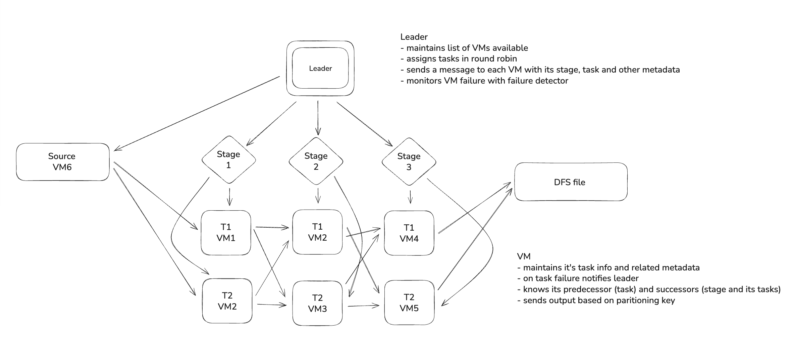
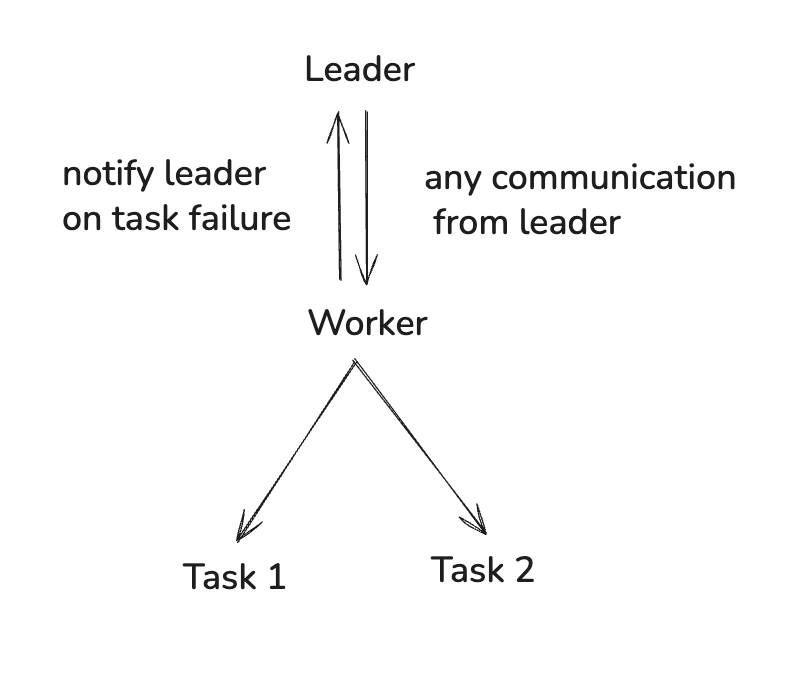

# rainstorm
distributed streaming application

**Authors:** Chitsimran Singh, Sara Agarwal\
**Course:** CS 425 - Distributed Systems – MP4\
**System Name:** RainStorm

---

> Disclaimer:
> This project does NOT include any code or ideas for MP1-MP3 as specified by course CS425's guidelines at UIUC.
> This project serves as a base implementation of how a distributed streaming application might look like.
> This was built as part of final MP of CS425 (offered at UIUC)

## Overview
RainStorm is a lightweight distributed stream processing framework. It executes multi-stage streaming pipelines across multiple machines using a **leader–worker architecture**. The system supports:

- Multi-stage DAG execution
- Parallel task execution per stage
- Task-level fault detection and restart
- Exactly-once style logging and recovery
- Dynamic load monitoring and autoscaling

RainStorm continuously processes streaming data using user-defined filter and transform operators.

## System Architecture

### Leader (RainStormMaster)
- Parses the user program and builds execution topology
- Constructs routing tables for inter-task communication
- Monitors worker health and per-task load
- Triggers autoscaling decisions
- Restarts failed tasks

### Workers
- Execute Source, Filter (Grep), and Transform tasks
- Stream tuples to downstream tasks using TCP
- Send load reports and failure notifications to the leader

### Networking
- Control-plane communication using Protocol Buffers
- Data-plane communication using TCP sockets
- Routing table is distributed before execution

## Core Components

### Task Types
The system implements three types of tasks, each handling different stages of the streaming pipeline:

**SourceStreamTask** - Reads input data from files and injects tuples into the pipeline. It uses rate limiting (via Guava's RateLimiter) to control throughput and ensure tuples are emitted at a steady rate. Once all data is read, it waits for pending tuple acknowledgments before finishing.

**WorkerTask** - Processes incoming tuples through user-defined operators. It maintains three internal buffers (received, processed, output) that batch tuples for efficient processing. Each tuple flows through: receive → process → emit downstream. The task spawns external Java processes to run custom operators and communicates via stdin/stdout using Protocol Buffers.

**Task Base Class** - All tasks extend from a base `Task` class that provides common functionality: tuple tracking, acknowledgment handling, logging to DFS, and socket-based communication. Tasks maintain a map of pending tuples awaiting acknowledgment and periodically resend unacknowledged tuples.

### Worker Management
The `Worker` class runs on each machine and acts as a supervisor for local tasks. When it receives task metadata from the leader, it spawns Java subprocesses using `TaskRunner` to execute individual tasks. Workers handle graceful shutdowns by first sending SIGTERM, waiting up to 10 seconds, then force-killing if necessary. They also maintain a `TaskSupervisor` that monitors task health.

### Tuple Flow and Batching
Tuples flow through the system using a batched processing model. Rather than logging and sending every tuple individually, tasks accumulate tuples in BlockingQueues and flush them in batches (default 1000 tuples or 500ms timeout). This significantly reduces disk I/O and network overhead. The batching strategy applies to logging received tuples, logging processed tuples, sending tuples to downstream tasks, and writing final output to DFS.

### Fault Tolerance
RainStorm achieves fault tolerance through write-ahead logging. Each task logs its state transitions to a DFS-backed log file before performing the actual operation:
- RECEIVED: tuple arrived from upstream
- PROCESSED: tuple transformation completed
- OUTPUT: tuple sent to downstream task
- ACK_SENT: acknowledgment sent to upstream
- ACK_RECEIVED: acknowledgment received from downstream

During recovery, tasks read their log files and reconstruct in-memory state. Tuples are replayed from the appropriate stage based on logged progress. This ensures exactly-once processing semantics even after failures.

### Load-Based Autoscaling
When autoscaling is enabled, worker tasks report their processing rate to the leader every second. The leader uses these metrics to detect load imbalances and trigger dynamic task additions or removals. Tasks are assigned to stages, and the leader can spawn additional parallel tasks for overloaded stages or remove tasks from underutilized ones.

### Metadata Updates
The system supports dynamic topology changes without stopping the entire pipeline. When the leader decides to scale, it sends updated metadata to affected workers. Workers compare the new routing table against the existing one and either spawn new tasks or gracefully stop removed tasks. Running tasks receive metadata updates via TCP and update their internal routing tables on-the-fly.

## Running RainStorm
The project on it's alone can not run. It requires a DFS implementation for storing log files on disk. Furthermore, it requires a membership protocol and a failure detector implementation. We had implemented them as part of earlier class projects at UIUC CS425 but have been excluded from this repo due to course guidelines.

I may re-implement it fully at some point in future (as per UIUC's guidelines).
